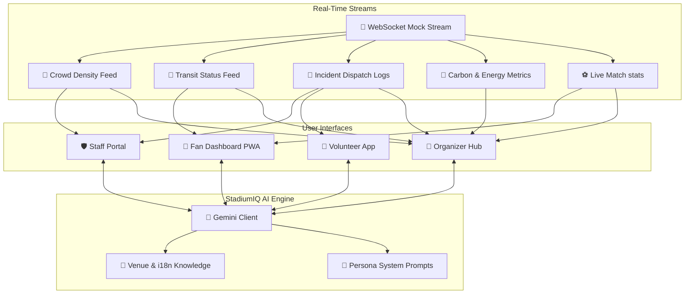
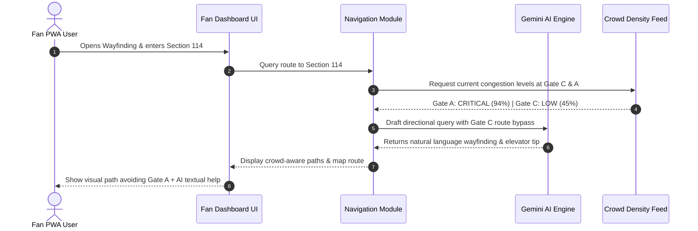
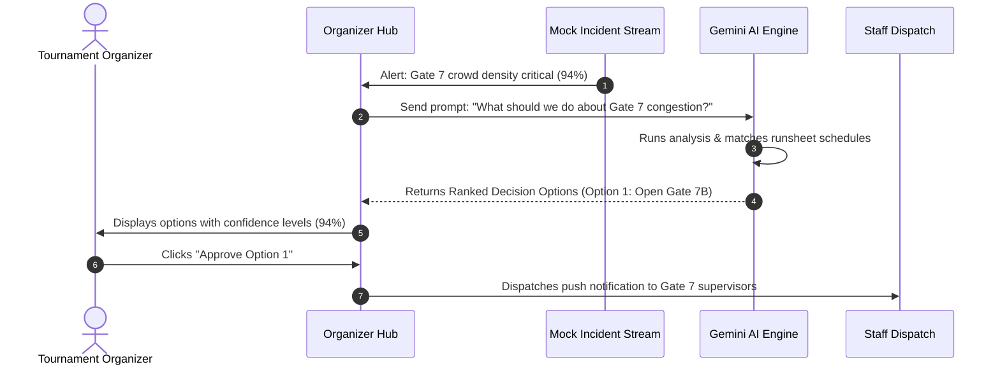

# StadiumIQ 2026 — GenAI Stadium Operations & Fan Experience

StadiumIQ 2026 is a premium, AI-native stadium operations and tournament experience platform built for the **FIFA World Cup 2026 (USA · Canada · Mexico)**. It leverages generative AI, real-time data streaming, and automated decision-making layers to enhance the experience of fans, stadium staff, volunteers, and tournament organizers.

---

## 🏗️ System Architecture

The following diagram illustrates the relationship between the front-end persona dashboards, the underlying mock real-time data streams, and the **Google Gemini AI Orchestration Layer**:



---

## 🔄 User Workflow Sequences

### 1. Fan Navigation & Wayfinding Workflow


### 2. Organizer Situation Room & Decision Support Workflow


---

## 🌟 Key Features

| Persona | AI Features | Live Metric Modules |
|---|---|---|
| **🎉 Fans** | • 50+ Language Voice Assistant<br>• Dynamic Match Commentary<br>• AI Departure Time Advisor | • Crowd-aware indoor mapping<br>• Transit arrivals & wait estimates<br>• Interactive Match Day Planner |
| **🛡️ Staff** | • Unstructured Accessibility Parser<br>• AI Incident Report Drafts<br>• Shift Briefing Generators | • Live Interactive Density Heatmaps<br>• Chart.js crowd trends<br>• Accessibility request queue |
| **🤝 Volunteers** | • Point-and-speak translation relay<br>• Structured Escalation logs<br>• Standard phrase translator | • Active Sector Crowd alerts<br>• Task management list |
| **🎯 Organizers** | • Situation Command Room<br>• Ranked Option Decision Engine<br>• Sustainability reports | • Carbon footprint status meters<br>• Real-time energy/water telemetry<br>• Runsheet audit gaps |

---

## 🛠️ Technology Stack

- **Core**: Vanilla HTML5, CSS3, ES6+ Javascript
- **Visual styling**: Harmonious dark theme, glassmorphism card decks, responsive structural grids, CSS animations
- **PWA Capabilities**: Service worker caching (`sw.js`), configuration manifest (`manifest.json`), offline-first asset caching
- **AI Integrations**: Gemini completions & context wrappers (`gemini-client.js`)
- **Charting**: Chart.js library (density trends, carbon performance logs)
- **Data simulation**: WebSocket emulation script (`websocket-mock.js`)

---

## 🚀 How to Set Up Locally

Since the app is built on a vanilla, serverless PWA architecture, you can run it easily:

### Option 1: Quick Launch (Local Files)
1. Clone or download the directory.
2. Double-click [index.html](index.html) to open the dashboard interface in any browser.

### Option 2: Local HTTP Server (Recommended for PWA testing)
For service worker registration to activate, you need a local web host:
```bash
# If you have Python installed:
python -m http.server 8000

# If you have Node.js / NPM installed:
npx http-server -p 8000
```
Open **[http://localhost:8000](http://localhost:8000)** in your browser.

---

## 📦 Pushing to GitHub

To push all project codes to your own GitHub repository, follow these quick commands:

```bash
# 1. Initialize git in this folder
git init

# 2. Add all assets, styles, and scripts
git add .

# 3. Commit files
git commit -m "Initial commit of StadiumIQ 2026"

# 4. Create your repo on GitHub, then link and push
git branch -M main
git remote add origin https://github.com/YOUR_USERNAME/stadiumiq.git
git push -u origin main
```
